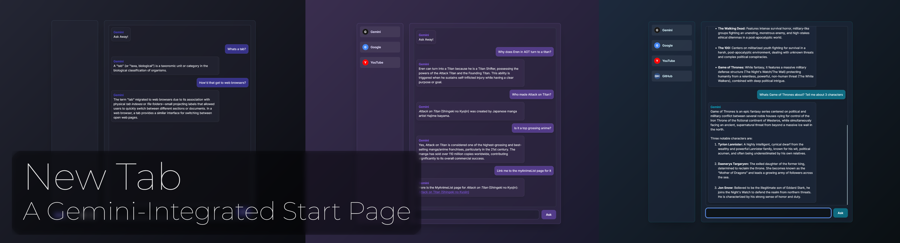
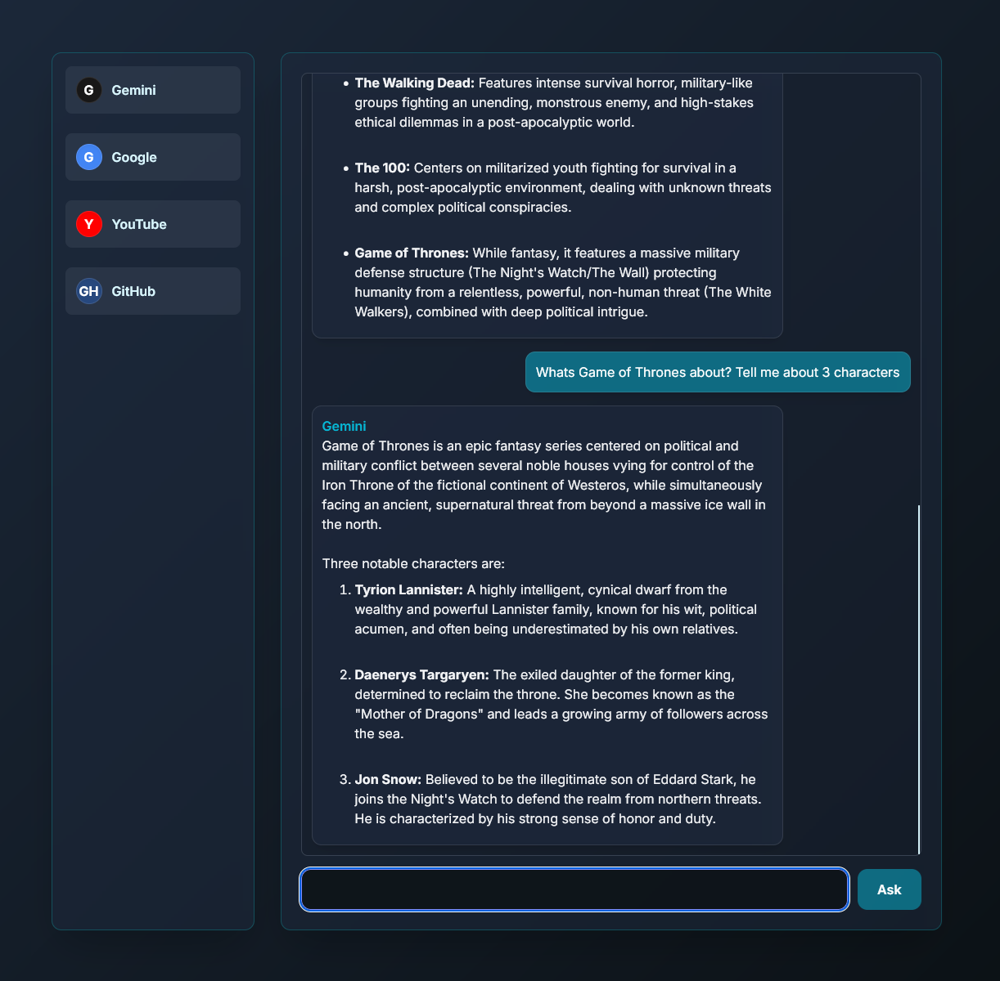
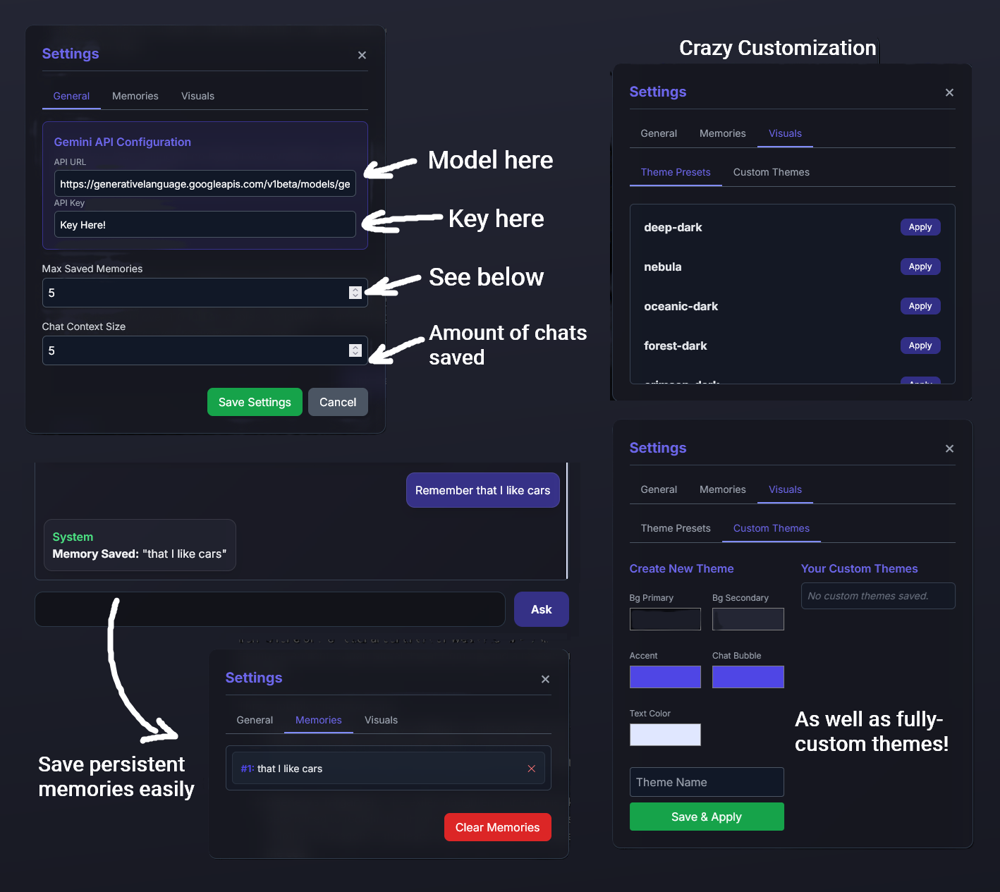

# Gemini New Tab ✦

[](https://addons.mozilla.org/en-US/firefox/addon/new-tab-gemini-start-page/)




> A simple AI-powered start page for Firefox.

**Gemini New Tab** replaces your default new tab page with a customizable productivity dashboard. It integrates Google's Gemini 2.0 Flash API directly into your browser, allowing you to ask questions, plan your day, and get summaries without switching tabs.

## Features

* **Integrated AI Chat:** Chat with Google Gemini directly from your start page.
* **Local Memory:** The AI remembers your preferences and context (stored locally) to give personalized answers. 
  * Start a sentance with 'Remember' to easily add something to persistent memory, up to a customizable amount of memories.
* **Speed Dial:** Pin your most visited sites with custom colors and icons.
* **Dynamic Theming:** Choose from presets like *Deep Dark*, *Nebula*, or create your own custom theme.
* **Rich Markdown Support:** Responses are rendered with full Markdown (tables, code blocks, bold/italics).
* **Privacy First:** Your API key and chat history never leave your device (except to reach Google's API). No data is sent to the developer.

---

## Screenshots

| AI Chat & Markdown | Settings & Theming |
|:---:|:---:|
|  |  |

---

##  Installation

### Option 1: Firefox Add-ons Store (Recommended)
The easiest way to install is via the official Mozilla store:
[**Download for Firefox**](https://addons.mozilla.org/en-US/firefox/addon/new-tab-gemini-start-page/)

### Option 2: Build from Source
If you are a developer or want to customize the code:

1.  **Clone the repository**
    ```bash
    git clone [https://github.com/shreywy/newTabGemini.git](https://github.com/shreywy/newTabGemini.git)
    cd newTabGemini
    ```

2.  **Install Dependencies**
    This project uses Tailwind CSS v3.
    ```bash
    npm install
    ```

3.  **Build the CSS**
    ```bash
    npm run build
    ```

4.  **Load in Firefox**
    * Open `about:debugging` in Firefox.
    * Click **This Firefox** > **Load Temporary Add-on...**
    * Select the `manifest.json` file from the project folder.

---

## Setup & Configuration

This extension requires a **Google Gemini API Key** to function. It is free to generate.

1.  Go to [Google AI Studio](https://aistudio.google.com/) and get an API Key. (The free tier will work)
2.  Open a new tab in Firefox.
3.  Enable edit mode in the bottom footer of the left panel (hover panel to see), then click the **Settings (Gear)** icon.
4.  Paste your key into the **API Key** field.
5. (Optional) Adjust the **Context Window** in settings to control how many previous messages the AI "remembers."
6. (Optional) Add pinned shortcuts by clicking the + icon, with edit mode enabled. Click on shortcuts to edit or delete shortcuts. 

---

## Tech Used

* **Frontend:** HTML5, Vanilla JavaScript
* **Styling:** Tailwind CSS (via CLI)
* **API:** Google Generative AI (Gemini 2.0 Flash)
* **Storage:** Firefox `browser.storage.local` API

## Privacy Policy

This extension is designed with a strict "Local-First" philosophy.

* **API Key:** Stored in your browser's local storage.
* **Chat History:** Stored in your browser's local storage.
* **Data Transmission:** Chat prompts are sent directly from your browser to Google's servers. No intermediate server or analytics are used.

## License

Distributed under the MIT License. See `LICENSE` for more information.